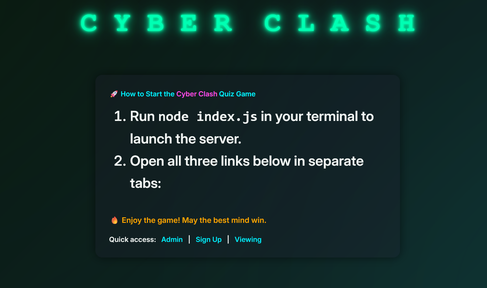
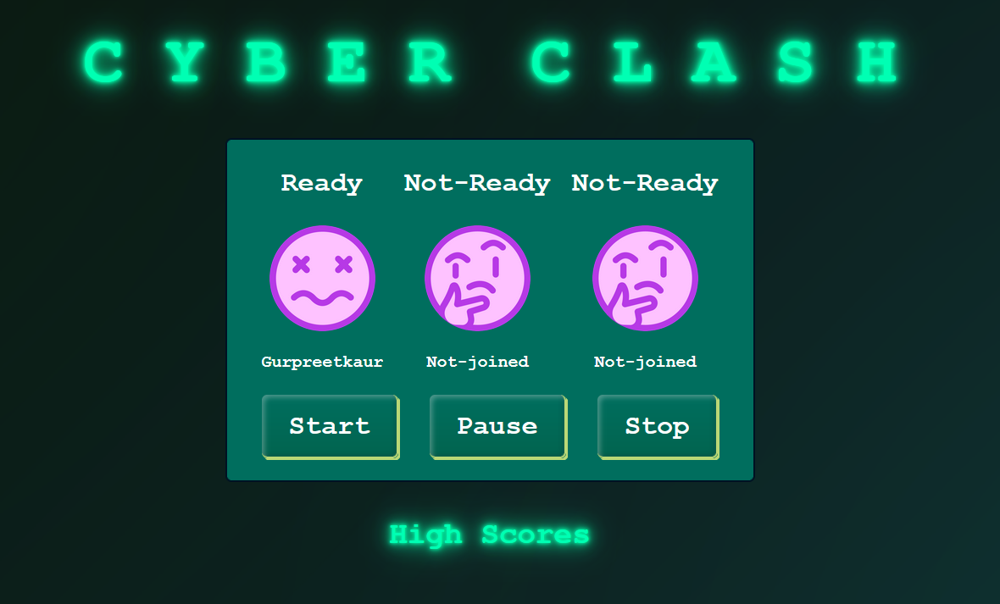
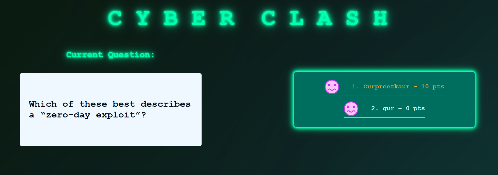

# ⚡ Cyber Clash - Real-Time Multiplayer Quiz Game

A full-stack real-time multiplayer quiz game built with **Node.js**, **Socket.IO**, **Express**, **SQLite**, and **vanilla JS**. Designed for LAN tournaments, Raspberry Pi booths, or any fun interactive classroom/office battle.

- 🎯 Play. Compete. Conquer.

---

## 🚀 Features

### 👥 Multiplayer System
- **Join with nickname and avatar emoji** 🎭
- Lobby supports up to **3 players simultaneously**
- Real-time updates when new players join
- Live player avatars and status display

### 🧠 Quiz Engine
- Supports **Multiple Choice (MCQ)** and **True/False (T/F)** questions
- 50+ questions loaded from the SQLite DB
- Real-time question emission to all players
- Per-question **countdown timer** 🕒

### 🕹️ Admin Panel
- Start, pause, stop quiz on the fly
- Skip or repeat questions if needed
- View live responses and manage game control centrally

### 🖥️ Viewing Screen
- Watch quiz progress on a dedicated display
- See player avatars, status, and live answers
- Great for projectors or public leaderboards

### 📊 Leaderboard System
- Real-time score updates after each question
- Rank players by correct answers
- Display nickname, avatar, and total score

### 💻 Backend Logic
- Built with `Express.js` for server routing
- Uses `Socket.IO` for real-time communication
- SQLite used for storing quiz questions and categories
- Global game state managed on server

---

## 🏗️ Tech Stack

| Area            | Tech Used                   |
|-----------------|-----------------------------|
| **Frontend**    | HTML, CSS, Vanilla JS       |
| **Backend**     | Node.js, Express.js         |
| **Real-Time**   | Socket.IO                   |
| **Database**    | SQLite (lightweight, fast)  |
| **Styling**     | Custom CSS + Google Fonts   |
| **Deployment**  | Can run locally or on LAN   |

---

## 📸 Screenshots



| Player Signup | Admin Panel | Viewing Leaderboard |
|---------------|-------------|----------------------|
|  |  |  |

---

## ⚙️ Setup Instructions

### 1. Clone the Repository
```bash
git clone https://github.com/Gur512/cyber-clash-quiz-game.git
cd cyber-clash-quiz-game
```
- Install Dependencies
```bash
npm install
```
- Run the Server
```bash
node index.js
```
### Open the Interfaces
- Open the following in different tabs:
- http://localhost:3000/admin/index.html → Admin Panel
- http://localhost:3000/viewing/index.html → Viewing Screen
- http://localhost:3000/gameplay/signUp.html → Player Sign-up

### 🧪 Testing Flow

- Run node index.js

- Open Admin Panel and click "Start Game"

- Players go to Sign-up page, enter nickname and select avatar

- Quiz begins with real-time syncing

- Leaderboard updates after each question

- Viewing screen reflects live status

### 📦 Folder Structure
```bash
cyber-clash/
│
├── public/
│   ├── admin/
│   ├── gameplay/
│   ├── viewing/
│   ├── css/
│   ├── js/
│   └── img/
│
├── db/
│   └── questions.db
│
├── index.js
├── .gitignore
└── README.md
```

### 💼 Author
- Gurpreet Kaur
- 💻 Software Developer | Full-Stack Enthusiast
- contact@thegurpreetdev.com
